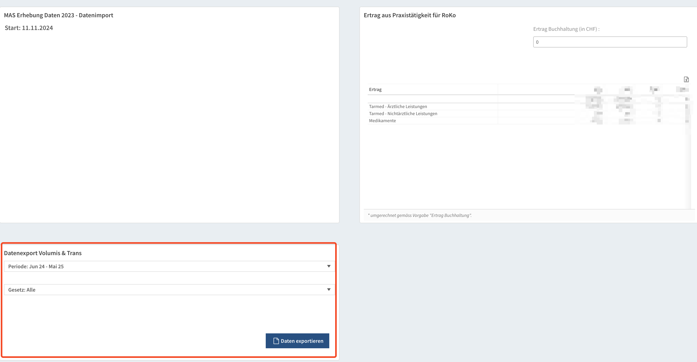

# Einleitung

Mit dem Wechsel des Leistungskatalogs von TARMED auf TARDOC kommen einige Veränderungen auf die abrechnenden Ärztinnen und Ärzte zu. Die Ärztekasse und die FMH stellen allen Mitgliedern ein kostenloses Tool ([Tartools.ch](www.tartools.ch)) zur Verfügung, mit dessen Hilfe sich die Auswirkungen des TARDOC auf die Abrechnung simulieren lassen.
Im folgenden wird kurz beschrieben, wie die eigenen Abrechnungsdaten in die Tartools importiert und ausgewertet werden können.

# Datenexport

Um zu erfahren, wie sich der TARDOC auf die Abrechnung auswirkt, müssen die eigenen Leistungsdaten importiert werden. Als Mitglied der Ärztekasse ist dies sehr einfach und wird hier nicht beschrieben. 
Ist die Praxis einem Trustcenter angeschlossen, gibt es wahrscheinlich die Möglichkeit, die eigenen Abrechnungsdaten als csv (comma seperated values) Datei zu exportieren. Praxen, die Tomedo als Praxisinformationssystem nutzen, können diese Daten auch direkt aus dem Programm exportieren und mithilfe eines Pythonskripts in das entsprechende Format für den Import in die Tartools umwandeln.

## Datenexport Trustcenter (syndata.ch)

Dieser Abschnitt beschreibt den Export der Daten aus dem Trustcenter syndata. Für die anderen Trustcenter existieren wahrscheinlich ähnliche Exportmöglichkeiten. Im Zweifelsfrei beim Trustcenter nachfragen.

1. Auf der ersten Seite des Praxisspiegels gibt es rechts unten eine Kachel mit Spezialauswertungen

2. Dort "Datenexport Volumis & Trans auswählen"

3. Auf der nächsten Seite links unten die Periode und ggf. das Gesetz (KVG) auswählen und auf "Daten exportieren" klicken

Die Daten werden als Excel-Datei exportiert und können heruntergeladen werden.

## Datenexport Tomedo

